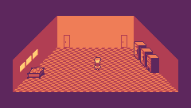

# Egg Game

Simple TIC-80 game project using the Rust / TIC-80 starter template.

Collect the eggs. Hatch mind-stopping prizes! Avoid various hazards along the way.

Play at [http://tic80.com/play?cart=3193](http://tic80.com/play?cart=3193)



## Running
To run, just load game.wasmp or game-stable.tic (from GitHub releases) into TIC-80, depending on your TIC-80 version.

|file|TIC-80 Version|
|---|---|
|game-stable.tic|1.0.2164|
|game.wasmp|>1.0.2164 (TIC-80 PRO required to load "text-based" carts)|

## TIC80 Stable vs TIC80 Main
This project currently targets version `1.0.2369-dev` of TIC-80, which is not yet stable.

To build for the stable version of TIC-80 (currently `1.0.2164`), the `void_mget` feature must be enabled (i.e. `cargo build --release --features void_mget`).

This feature is required because the WASM function signature of `mget()` differs between the stable and main. Support for the stable branch is also needed to upload to the TIC-80 website.

## Building
To build, first make sure you have installed the `wasm32-unknown-unknown` target using rustup:

```
rustup target add wasm32-unknown-unknown
```

Then, to build a cart.wasm file, run:

```
cargo build --release
```

To import the resulting WASM to a cartridge:

```
tic80 --fs . --cmd 'load game.tic & import binary target/wasm32-unknown-unknown/release/cart.wasm & save'
```

Or from the TIC-80 console:

```
load game.tic
import binary target/wasm32-unknown-unknown/release/cart.wasm
save
```

This is assuming you've run TIC-80 with `--fs .` inside your project directory.


## wasm-opt
It is highly recommended that you run `wasm-opt` on the output `cart.wasm` file, especially if using the usual unoptimised builds. To do so, make sure `wasm-opt` is installed, then run:
```
wasm-opt -Os target/wasm32-unknown-unknown/release/cart.wasm -o cart.wasm
```
This will create a new, smaller `cart.wasm` file in the working directory.

# Repo Layout

|File|Description|
|---|---|
|`src/alloc.rs`|Memory allocation (from the original TIC-80 Rust template) (and, before that, from the WASM4 Rust template).|
|`src/animation.rs`|Small helper structs for animating sprite indexes and positions.|
|`src/camera.rs`|Different camera behaviours and logic to automatically pick based on map layout.|
|`src/dialogue.rs`|Drawing text character-by-character, automatically adding line-breaks.|
|`src/dialogue_data.rs`|All text-strings used in game.|
|`src/gamestate.rs`|Logic for switching between game menus and gameplay.|
|`src/input_manager.rs`|Helper functions for keyboard and mouse input.|
|`src/interact.rs`|Struct for interactable map objects.|
|`src/lib.rs`|Main file. Defines the `TIC()` and `BOOT()` functions run by TIC-80.|
|`src/map_data.rs`|Defines each game "area" and the locations of interactable objects.|
|`src/map.rs`|Structs used in `map_data.rs`.|
|`src/player.rs`|Player struct and animation helper functions.|
|`src/position.rs`|Vec2 and Hitbox types used for collision detection.|
|`src/rand.rs`|PCG32 RNG from Rust Rand crate.|
|`src/save.rs`|Helpers for saving to the 'PERSISTENT_RAM' section of TIC-80 memory.|
|`src/tic80.rs`|TIC-80 WASM function bindings and memory addresses. From the original TIC-80 Rust template.|
|`src/tic_helpers.rs`|Miscellaneous helper functions for interacting with TIC-80 memory.|
|`src/walkaround.rs`|RPG-style map navigation.|
